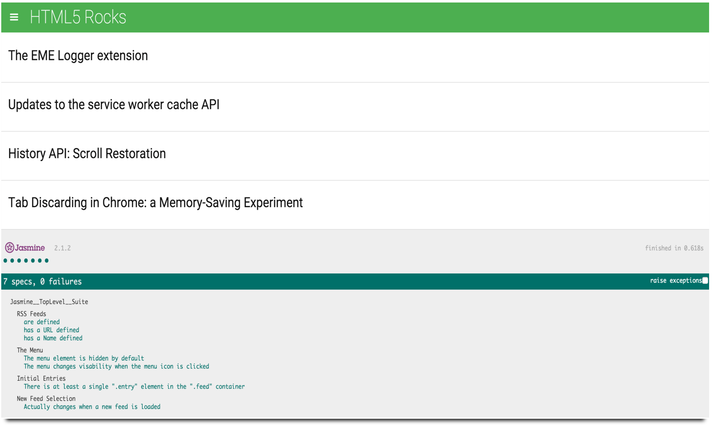

## Feedreader Testing
This project focuses on _“test driven development”_ using a web-based application that reads RSS feeds. This was accomplished using [**Jasmine**](http://jasmine.github.io/) to write a number of tests against a pre-existing application to test the underlying business logic of the application, event handling, and DOM manipulation.

The practice of scripting well written tests gives us the ability to analyze whether new code introduced to a program will break the existing functionality without having to manually test all aspects of the code.

You can view this project on it's GitHub Pages site [**here**](http://samurairanderson.github.io/P6-Feedreader/#).

###Technologies Used:
* Jasmine
* JavaScript
* jQuery

###Steps to run this application

Clone this repo:

* `$ git clone https://github.com/SamuraiRanderson/https://github.com/SamuraiRanderson/P6-Feedreader.git` or `Download Zip` button on the right hand side of this page.
* `$ cd P6-Feedreader` 

Run index.html:

* Open `index.html` in your browser.
* You will see the successful Jasmine.js specs at the bottom of the page.

The tests are available to view in the [feedreader.js](https://github.com/SamuraiRanderson/P6-Feedreader/blob/master/jasmine/spec/feedreader.js) file.

